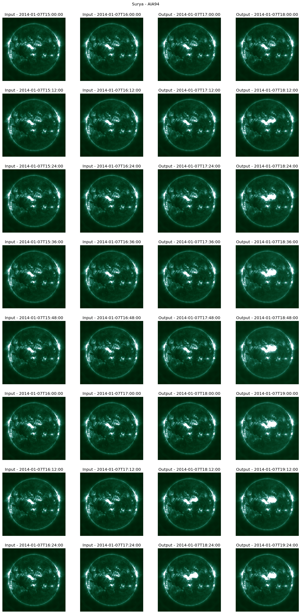

<div align="center">

# ☀️ Surya: Foundation Model for Heliophysics ☀️

[](https://opensource.org/licenses/Apache-2.0)
[](https://www.python.org/downloads/release/python-3110/)
[](https://pytorch.org/)
[](https://huggingface.co/nasa-ibm-ai4science)

*The first foundation model for heliophysics trained on full-resolution Solar Dynamics Observatory data*

</div>

<p align="center">
    
</p>


## 📖 Overview

**Surya** (Sanskrit for "Sun") is a 366M-parameter foundation model for heliophysics, trained on full-resolution multi-instrument SDO observations (AIA & HMI). It learns general-purpose solar representations through spatiotemporal transformers, enabling state-of-the-art performance in solar flare forecasting, active region segmentation, solar wind prediction, and EUV spectra modeling.


### Key Features

- **Multi-instrument Learning**: Trained on 13 channels from SDO's AIA (8 channels) and HMI (5 channels) instruments
- **Full Resolution**: Native 4096×4096 pixel resolution with 12-minute cadence
- **Novel Architecture**: Spatiotemporal transformer with spectral gating and long-short range attention
- **Zero-shot Capabilities**: Forecasts solar dynamics and flare events without additional training
- **Versatile Fine-tuning**: Parameter-efficient LoRA adaptation for diverse downstream tasks
- **Real-world Impact**: Applications in space weather prediction, satellite operations, and power grid protection

### What Makes Surya Special?

Unlike traditional task-specific models, Surya learns physics-aware representations that generalize across multiple solar phenomena:

- **Solar Flare Forecasting**
- **Active Region Segmentation**
- **Solar Wind Prediction**
- **EUV Spectra Modeling**

## 🚀 Quick Start

### Prerequisites

- Python 3.11+
- CUDA-capable GPU (recommended)
- [uv package manager](https://docs.astral.sh/uv/) (recommended)

### 🛠️ Installation

1. **Clone the repository**
```bash
git clone https://github.com/NASA-IMPACT/Surya.git
cd Surya
```

2. **Install uv package manager (optional)**
```bash
curl -LsSf https://astral.sh/uv/install.sh | sh
source ~/.bashrc
```

3. **Set up the environment**
```bash
uv sync
source .venv/bin/activate
```

### 🧪 Verify Installation

Run the end-to-end test to ensure everything is working:

```bash
python -m pytest -s -o log_cli=true tests/test_surya.py
```

This will:
- Download the pretrained model and test data
- Generate 2-hour ahead forecasts for 2014-01-07
- Create a validation visualization (`surya_model_validation.png`)
- Verify model inference

Expected output:
```
============================= test session starts ==============================
INFO     test_surya:test_surya.py:188 GPU detected. Running the test on device 0.
INFO     test_surya:test_surya.py:195 Surya FM: 366.19 M total parameters.
INFO     test_surya:test_surya.py:199 Loaded weights.
INFO     test_surya:test_surya.py:201 Starting inference run.
INFO     test_surya:test_surya.py:215 Completed validation run. Local loss 0.31665.
PASSED                                                    [100%]
```



## 🎯 Downstream Applications

### 1. Solar Flare Forecasting

Predict M-class and X-class solar flares up to 24 hours in advance.

```bash
cd downstream_examples/solar_flare_forcasting
python3 download_data.sh
torchrun --nnodes=1 --nproc_per_node=1 --standalone finetune.py
```

### 2. Active Region Segmentation

Segment solar active regions and polarity inversion lines from magnetograms.

```bash
cd downstream_examples/ar_segmentation  
python3 download_data.sh
torchrun --nnodes=1 --nproc_per_node=1 --standalone finetune.py
```

### 3. Solar Wind Forecasting

Predict solar wind speed at L1 point with 4-day lead time.

```bash
cd downstream_examples/solar_wind_forcasting
python3 download_data.sh
torchrun --nnodes=1 --nproc_per_node=1 --standalone finetune.py
```

### 4. EUV Spectra Modeling

Model extreme ultraviolet irradiance across 1343 spectral bands (5-35 nm).

```bash
cd downstream_examples/euv_spectra_prediction
python3 download_data.sh
torchrun --nnodes=1 --nproc_per_node=1 --standalone finetune.py
```


## 📥 Data and Model Access

### Pretrained Models

The Surya foundation model and datasets are available on HuggingFace 🤗 :

- **Model Repository**: [`nasa-ibm-ai4science/Surya-1.0`](https://huggingface.co/nasa-ibm-ai4science/Surya-1.0)
- **Dataset Repository**: [`nasa-ibm-ai4science/SDO_training`](https://huggingface.co/datasets/nasa-ibm-ai4science/SDO_training)

### SDO Data Download

For downstream applications, download the preprocessed SDO data:

```bash
cd downstream_examples
python download_data.py
```

This will:
1. Download data from HuggingFace repository
2. Extract and organize validation/test datasets  
3. Generate CSV index files for each downstream task
4. Set up data in the expected directory structure


## 📊 Model Architecture

Surya employs a novel spatiotemporal transformer architecture optimized for solar dynamics:

### Core Components

1. **Spectral Gating Blocks** (2 layers)
   - Frequency-domain filtering with learnable complex weights
   - Adaptive re-weighting of spectral components
   - Noise suppression and feature enhancement

2. **Long-Short Attention Blocks** (8 layers) 
   - **Local attention**: Fine-scale dependencies within spatial windows
   - **Global attention**: Long-range correlations via dynamic projection
   - Multi-scale representation learning

3. **Decoder Block**
   - Lightweight projection back to physical domain
   - Maintains spatial structure and channel relationships

### Training Strategy

- **Phase 1**: One-step ahead forecasting (160k steps, 128 GPUs)
- **Phase 2**: Autoregressive rollout tuning (2-5 hour horizons)
- **Objective**: Mean Squared Error with signum-log normalization
- **Data**: 2011-2019 SDO observations (~257TB processed)


### Data Processing Pipeline

Our preprocessing ensures ML-ready, physics-consistent data:

- **Temporal alignment**: 12-minute cadence across all instruments
- **Spatial registration**: Uniform 0.6"/pixel grid, solar north alignment
- **Calibration**: Instrument degradation correction, exposure normalization
- **Quality control**: Automated flagging and filtering

## 🏆 Performance Benchmarks

| Task | Metric | Surya | Baseline | Improvement |
|------|---------|-------|----------|-------------|
| Solar Flare Forecasting | TSS | **0.436** | 0.358 (AlexNet) | 22% |
| Active Region Segmentation | IoU | **0.768** | 0.688 (UNet) | 12% |  
| Solar Wind Prediction | RMSE | **75.92** | 93.76 (ResNet50) | 19% |
| EUV Spectra Modeling | MAPE | **1.48%** | 1.68% (AlexNet) | 12% |

## 📄 Citation

If you use Surya in your research, please cite our paper:

```bibtex
@article{roy2024surya,
  title={Surya: Foundation Model for Heliophysics},
  author={Roy, Sujit and Schmude, Johannes and Lal, Rohit and Gaur, Vishal and Freitag, Marcus and others},
  journal={arXiv preprint},
  year={2025}
}
```

## 📜 License

This project is licensed under the Apache License 2.0. See the [LICENSE](LICENSE) file for details.

## 🤝 Contributing

We welcome contributions to the Surya repository! Please see our contribution guidelines and feel free to:

- 🐛 Report bugs and issues
- 💡 Suggest new features or applications
- 🔧 Submit pull requests for improvements
- 📖 Improve documentation and examples

## 👥 Authors

**[Sujit Roy](https://www.linkedin.com/in/sujit-roy01/)**<sup>1,2</sup>, **[Johannes Schmude](https://www.linkedin.com/in/johannes-schmude-202566125/)**<sup>5</sup>, **[Rohit Lal](https://www.linkedin.com/in/rohit-lal/)**<sup>1</sup>, **[Vishal Gaur](https://www.linkedin.com/in/vishal-gaur/)**<sup>1</sup>, **[Marcus Freitag](https://scholar.google.com/citations?user=1WR9X28AAAAJ&hl=en)**<sup>5</sup>, **[Julian Kuehnert](https://www.linkedin.com/in/juliankuehnert/)**<sup>5</sup>, **[Theodore van Kessel](https://www.linkedin.com/in/ted-van-kessel-41b62511/)**<sup>5</sup>, **[Dinesha V. Hegde](https://www.linkedin.com/in/dinesh-hegde-936905157/)**<sup>3,4</sup>, **[Andrés Muñoz-Jaramillo](https://www.linkedin.com/in/amunozj/)**<sup>7</sup>, **[Johannes Jakubik](https://www.linkedin.com/in/johannes-jakubik-8763ba167/)**<sup>5</sup>, **[Etienne Vos](https://www.linkedin.com/in/etiennevos/)**<sup>5</sup>, **[Kshitiz Mandal](https://www.linkedin.com/in/kshitizmandal/)**<sup>1</sup>, **[Ata Akbari Asanjan](https://www.linkedin.com/in/ataakbariasanjan/)**<sup>13</sup>, **[Joao Lucas de Sousa Almeida](https://www.linkedin.com/in/jo%C3%A3o-lucas-de-sousa-almeida-a08b9255/)**<sup>5</sup>, **[Amy Lin](https://github.com/aes-lin)**<sup>1</sup>, **[Talwinder Singh](https://www.linkedin.com/in/talwinder-singh-dhami/)**<sup>6</sup>, **Kang Yang**<sup>6</sup>, **[Chetraj Pandey](https://www.linkedin.com/in/chetraj-pandey-671388125/)**<sup>6</sup>, **Jinsu Hong**<sup>6</sup>, **[Berkay Aydin](https://www.linkedin.com/in/berkay-aydin/)**<sup>6</sup>, **[Thorsten Kurth](https://www.linkedin.com/in/thorstenkurth/)**<sup>14</sup>, **[Ryan McGranaghan](https://www.linkedin.com/in/ryanmcgranaghan/)**<sup>8</sup>, **[Spiridon Kasapis](https://www.linkedin.com/in/spyroskasapis/)**<sup>9</sup>, **[Vishal Upendran](https://www.linkedin.com/in/vishal-upendran1995/)**<sup>10</sup>, **[Shah Bahauddin](https://www.linkedin.com/in/shahbahauddin/)**<sup>11</sup>, **[Daniel da Silva](https://www.linkedin.com/in/daniel-da-silva-8a836b20b/)**<sup>12</sup>, **[Nikolai V. Pogorelov](https://www.linkedin.com/in/nikolai-pogorelov-56383b42/)**<sup>3,4</sup>, **[Campbell Watson](https://www.linkedin.com/in/campbell-watson-819101100/)**<sup>5</sup>, **[Manil Maskey](https://www.linkedin.com/in/manilmaskey/)**<sup>2</sup>, **[Madhulika Guhathakurta](https://www.linkedin.com/in/mguhathakurta/)**<sup>15</sup>, **[Juan Bernabe-Moreno](https://www.linkedin.com/in/bernabemoreno/)**<sup>5</sup>, **[Rahul Ramachandran](https://www.linkedin.com/in/rramachandran05/)**<sup>2</sup>

### Affiliations

<sup>1</sup>Earth System Science Center, University of Alabama in Huntsville, AL, USA  
<sup>2</sup>NASA Marshall Space Flight Center, Huntsville, AL, USA  
<sup>3</sup>Department of Space Science, University of Alabama in Huntsville, AL, USA  
<sup>4</sup>Center for Space Plasma and Aeronomic Research (CSPAR), University of Alabama in Huntsville, AL, USA  
<sup>5</sup>IBM Research  
<sup>6</sup>Georgia State University  
<sup>7</sup>Southwest Research Institute  
<sup>8</sup>NASA Jet Propulsion Laboratory  
<sup>9</sup>Princeton University  
<sup>10</sup>SETI Institute  
<sup>11</sup>Laboratory for Atmospheric and Space Physics, University of Colorado Boulder  
<sup>12</sup>NASA Goddard Space Flight Center  
<sup>13</sup>Research Institute for Advanced Computer Science, Universities Space Research Association, USA  
<sup>14</sup>NVIDIA Corp., Santa Clara, USA; Caltech, Pasadena, USA  
<sup>15</sup>NASA Science Mission Directorate

